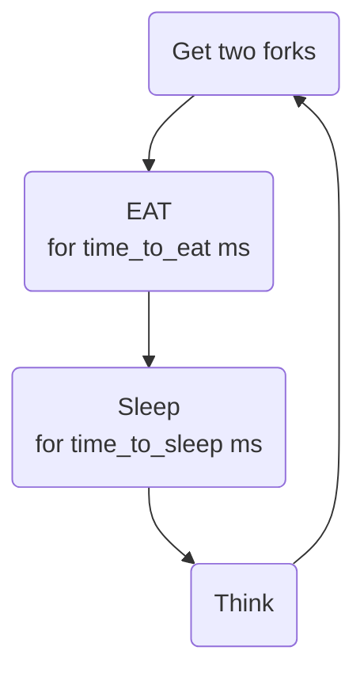

***PHILOSOPHERS***

**I. ABOUT THE DINING PHILOSPHRES PROBLEM**

This Hive Helsinki project's purpose was to introduce us to multithreading. The dining philosophers' problem was used to demonstrate the concept, which goes as follows:

- N number of philosophers sit at a round table
- there's a bowl of spaghetti in the middle of the table
- all philosopher's have their own fork to their right
- a philosopher needs to forks to eat: its own, and its neighbour's
- after eating, a philosopher will go to sleep
- after waking up, a philosopher will start thinking and waits for a chance to eat again
- the philosphers can't talk to each other

**II. THE PROGRAM**

Instead, the program takes four arguments, plus an optional one:

1. The number of philosophers
2. The time_to_die in milliseconds: if a philosopher did not start eating at least this many miliseconds since it has last started eating (or the start of the simulation), it will die
3. The time_to_eat in milliseconds: the time it takes for a philosopher to finish eating - needs two forks for the whole duration
4. The time_to_sleep in milliseconds: after a philosopher has eaten, it will go to sleep for time_to_sleep milliseconds
5. Optional: the number of times *all* philosophers need to have finished eating for the simulation to stop. If not specified, the simulation will stop if a philosopher has died

The program prints logs to the standard output in the following format:

"timestamp in milliseconds" "number of the philosopher" "event"

The program works by creating a thread to represent each philosopher. The forks are represented as mutexes to prevent two philosophers from using the same fork at once.
Other mutexes are also utilized to keep track of the times philosophers have eaten, if any died, or if any is printing a log entry to prevent race conditions
